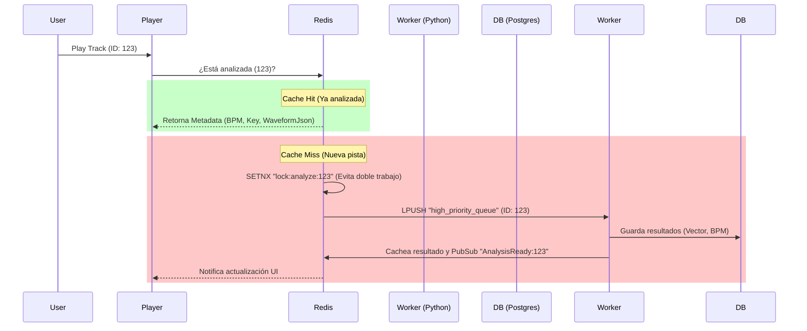

# Estrategia de Arquitectura AI & Análisis Híbrido

Este documento define cómo Sonántica manejará el análisis de audio masivo, la optimización de recursos y la búsqueda semántica, respondiendo a la necesidad de integrar "Calidad Audiófila" y AI sin sacrificar rendimiento.

## 1. El Dilema: ¿Cuándo analizar la música?

Para mantener una experiencia fluida ("Web-first"), adoptamos una **Estrategia Híbrida**:

### A. Capa Cliente (Efímera - "Lo que oyes ahora")
*   **Responsabilidad:** Visualización inmediata (Goniómetro, Vúmetros, DR Meter).
*   **Tecnología:** Web Audio API (`AudioAnalyzer` package).
*   **Almacenamiento:** **Ninguno.** Los datos viven y mueren en la memoria del navegador (RAM).
*   **¿Por qué?** Sería inútil guardar el análisis de fase de cada milisegundo de una canción. Solo interesa verlo en tiempo real.

### B. Capa Servidor (Persistente - "Lo que ES la canción")
*   **Responsabilidad:** Separación de Stems (Demucs), Detección de BPM, Key, Vectores de Similitud, ReplayGain.
*   **Tecnología:** Python Worker + PyTorch + Librosa.
*   **Almacenamiento:** PostgreSQL + Redis.
*   **Trigger:** 
    1.  **Scan Inicial:** Tarea de fondo (baja prioridad).
    2.  **On-Play:** Si el usuario reproduce una canción no analizada, se envía a una "Cola Prioritaria" en Redis.

---

## 2. Flujo de Datos y Optimización (Redis)

Redis actúa como el "Controlador de Tráfico" para evitar que el análisis sature el streaming.



### Optimización de Archivos en Uso
Para evitar conflictos de lectura (Streaming vs Análisis):
1.  **Read-Only Mounts:** El worker de Python monta el volumen de medios como `ro` (Read Only). Nunca modifica el archivo original.
2.  **Archivos Derivados:** Los Stems (Voz, Batería, etc.) se escriben en una carpeta separada `/stems/` gestionada por Sonántica, nunca en la biblioteca del usuario.

---

## 3. La "Super-Solución": Semántica con pgvector

Aquí es donde entra **PostgreSQL Vector (`pgvector`)**. En lugar de buscar solo por "Género: Rock", podemos buscar por "Textura Sónica".

### ¿Cómo funciona?
1.  **Extracción:** El Python Worker usa un modelo pre-entrenado (ej. `openl3` o una capa intermedia de un CNN de audio) para generar un **Embedding**.
    *   *Embedding:* Una lista de 512 números que representan "cómo suena" la pista (Tempo, Timbre, Energía).
2.  **Almacenamiento:** 
    ```sql
    ALTER TABLE tracks ADD COLUMN embedding vector(512);
    ```
3.  **Uso Práctico "Sonic Search":**
    *   *Caso de uso:* "Reproducir más canciones que suenen como esta".
    *   *Query:* `SELECT * FROM tracks ORDER BY embedding <-> current_track_embedding LIMIT 20;`
    *   *Resultado:* Una lista de reproducción generada no por etiquetas manuales (que pueden estar mal), sino por la **física del sonido**.

---

## 4. Estrategia de Stems (Demucs/PyTorch)

Dado el peso de estos archivos (4x el tamaño original en FLAC):
1.  **Análisis Bajo Demanda:** No separar toda la biblioteca (ocuparía TBs).
2.  **Flag `is_separated`:** Solo separar canciones que el usuario marque como "Studio Mode" o "Karaoke Ready".
3.  **Cache Inteligente:** Si no se usan los stems en 30 días, borrarlos (manteniendo el archivo original intacto) para liberar espacio.

---

## 5. Resumen de Valor para el Usuario

| Dato Analizado | Uso Visual (Cliente) | Uso Inteligente (Servidor/DB) |
| :--- | :--- | :--- |
| **BPM / Tempo** | Sincronizar visualizadores | Smart Playlists "Running" (120-140 BPM) |
| **Key / Tonalidad** | Mostrar nota musical | Mezcla Armónica (DJ style transitions) |
| **Vectores** | - | Radio Inteligente ("Sonic Match") |
| **Stems** | Mixer de 4 canales | Karaoke, Práctica de instrumentos |
| **Loudness (LUFS)** | - | ReplayGain (Nivelar volumen entre pistas) |

Esta arquitectura convierte a Sonántica en un **Sistema Activo** que aprende de la música, justificando el uso de Docker y máquinas potentes, pero manteniendo el cliente web ligero y rápido.
