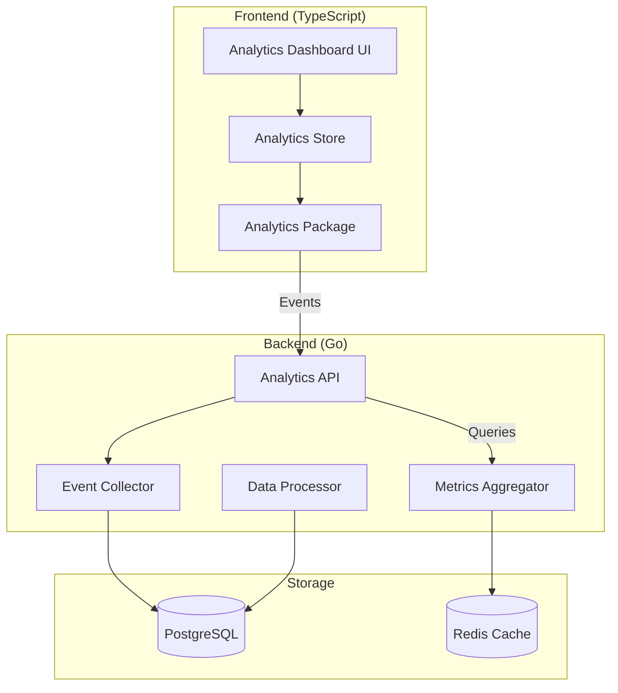

# Analytics Dashboard Feature - Implementation Plan

## Overview
This document outlines the implementation of a comprehensive analytics dashboard for Sonántica, respecting the architectural principles of separation of concerns, SOLID principles, and the brand's philosophy of **Technical Transparency**.

## Philosophy Alignment
> "Respect the intention of the sound and the freedom of the listener."

The analytics feature serves to:
- **Educate** users about their listening patterns
- **Respect privacy** by keeping data local-first with optional sync
- **Provide transparency** into how the system works
- **Enable informed decisions** about music discovery

---

## Architecture Overview



---

## 1. Data Collection Strategy

### 1.1 Events to Track

#### Session Events
- `session.start` - When user opens the app
- `session.end` - When user closes/backgrounds the app
- `session.heartbeat` - Periodic ping (every 5 minutes)

#### Playback Events
- `playback.start` - Track starts playing
- `playback.pause` - Track paused
- `playback.resume` - Track resumed
- `playback.stop` - Track stopped
- `playback.skip` - Track skipped
- `playback.complete` - Track played to completion
- `playback.seek` - User seeks within track
- `playback.progress` - Periodic progress updates (every 10s)

#### Library Events
- `library.scan` - Library scan initiated
- `library.track_added` - New track added
- `track.favorite` - Track favorited
- `playlist.created` - Playlist created
- `playlist.modified` - Playlist modified

#### User Interaction Events
- `ui.view_change` - User navigates to different view
- `search.query` - User performs search
- `eq.preset_changed` - EQ preset changed
- `dsp.settings_changed` - DSP settings modified

### 1.2 Event Payload Structure

```typescript
interface AnalyticsEvent {
  // Event Identity
  eventId: string;
  eventType: string;
  timestamp: number;
  
  // Session Context
  sessionId: string;
  userId?: string; // Optional, for multi-user setups
  
  // Platform Context
  platform: 'web' | 'mobile' | 'desktop';
  browser: string;
  browserVersion: string;
  os: string;
  osVersion: string;
  
  // Location Context (Privacy-conscious)
  locale: string; // e.g., "en-US"
  timezone: string;
  ipHash?: string; // Hashed IP for privacy
  
  // Event-specific Data
  data: Record<string, any>;
}
```

### 1.3 Playback-Specific Data

```typescript
interface PlaybackEventData {
  trackId: string;
  albumId: string;
  artistId: string;
  
  // Playback Context
  position: number; // Current position in seconds
  duration: number; // Track duration
  volume: number;
  
  // Quality Metrics
  codec: string;
  bitrate: number;
  sampleRate: number;
  
  // Context
  source: 'library' | 'playlist' | 'queue' | 'recommendation';
  sourceId?: string;
  
  // DSP State
  eqEnabled: boolean;
  eqPreset?: string;
  dspEffects: string[];
}
```

---

## 2. Backend Implementation

### 2.1 New Service: `analytics-service` (Go)

**Location:** `/services/analytics-service/`

**Responsibilities:**
- Receive analytics events via HTTP/WebSocket
- Validate and sanitize incoming data
- Store raw events in PostgreSQL
- Aggregate metrics in real-time
- Provide query API for dashboard

**Key Components:**

```
services/analytics-service/
├── cmd/
│   └── server/
│       └── main.go
├── internal/
│   ├── collector/
│   │   ├── handler.go       # HTTP handlers for event ingestion
│   │   └── validator.go     # Event validation
│   ├── processor/
│   │   ├── aggregator.go    # Real-time aggregation
│   │   └── metrics.go       # Metric calculations
│   ├── storage/
│   │   ├── postgres.go      # PostgreSQL operations
│   │   └── redis.go         # Redis caching
│   └── api/
│       ├── routes.go        # API routes
│       └── handlers.go      # Query handlers
├── pkg/
│   └── models/
│       ├── event.go         # Event models
│       └── metrics.go       # Metric models
├── Dockerfile
└── go.mod
```

### 2.2 Database Schema

```sql
-- Sessions Table
CREATE TABLE analytics_sessions (
    id UUID PRIMARY KEY DEFAULT gen_random_uuid(),
    session_id VARCHAR(255) UNIQUE NOT NULL,
    user_id VARCHAR(255),
    platform VARCHAR(50) NOT NULL,
    browser VARCHAR(100),
    browser_version VARCHAR(50),
    os VARCHAR(100),
    os_version VARCHAR(50),
    locale VARCHAR(10),
    timezone VARCHAR(50),
    ip_hash VARCHAR(64),
    started_at TIMESTAMP NOT NULL,
    ended_at TIMESTAMP,
    last_heartbeat TIMESTAMP,
    created_at TIMESTAMP DEFAULT NOW()
);

-- Events Table (Raw events)
CREATE TABLE analytics_events (
    id BIGSERIAL PRIMARY KEY,
    event_id UUID UNIQUE NOT NULL,
    session_id VARCHAR(255) NOT NULL REFERENCES analytics_sessions(session_id),
    event_type VARCHAR(100) NOT NULL,
    timestamp TIMESTAMP NOT NULL,
    data JSONB NOT NULL,
    created_at TIMESTAMP DEFAULT NOW()
);

-- Playback Sessions (Aggregated)
CREATE TABLE playback_sessions (
    id BIGSERIAL PRIMARY KEY,
    session_id VARCHAR(255) NOT NULL,
    track_id VARCHAR(255) NOT NULL,
    album_id VARCHAR(255),
    artist_id VARCHAR(255),
    started_at TIMESTAMP NOT NULL,
    ended_at TIMESTAMP,
    duration_played INTEGER, -- seconds
    completion_percentage DECIMAL(5,2),
    source VARCHAR(50),
    source_id VARCHAR(255),
    codec VARCHAR(50),
    bitrate INTEGER,
    eq_enabled BOOLEAN,
    eq_preset VARCHAR(100),
    created_at TIMESTAMP DEFAULT NOW()
);

-- Track Statistics (Pre-aggregated for performance)
CREATE TABLE track_statistics (
    track_id VARCHAR(255) PRIMARY KEY,
    play_count INTEGER DEFAULT 0,
    complete_count INTEGER DEFAULT 0,
    skip_count INTEGER DEFAULT 0,
    total_play_time INTEGER DEFAULT 0, -- seconds
    average_completion DECIMAL(5,2),
    last_played_at TIMESTAMP,
    updated_at TIMESTAMP DEFAULT NOW()
);

-- Listening Heatmap (Time-based patterns)
CREATE TABLE listening_heatmap (
    id BIGSERIAL PRIMARY KEY,
    date DATE NOT NULL,
    hour INTEGER NOT NULL CHECK (hour >= 0 AND hour < 24),
    play_count INTEGER DEFAULT 0,
    unique_tracks INTEGER DEFAULT 0,
    total_duration INTEGER DEFAULT 0,
    UNIQUE(date, hour)
);

-- Track Segments (Most listened parts)
CREATE TABLE track_segments (
    id BIGSERIAL PRIMARY KEY,
    track_id VARCHAR(255) NOT NULL,
    segment_start INTEGER NOT NULL, -- seconds
    segment_end INTEGER NOT NULL,   -- seconds
    play_count INTEGER DEFAULT 0,
    created_at TIMESTAMP DEFAULT NOW(),
    UNIQUE(track_id, segment_start, segment_end)
);

-- Indexes for performance
CREATE INDEX idx_events_session ON analytics_events(session_id);
CREATE INDEX idx_events_type ON analytics_events(event_type);
CREATE INDEX idx_events_timestamp ON analytics_events(timestamp);
CREATE INDEX idx_playback_track ON playback_sessions(track_id);
CREATE INDEX idx_playback_started ON playback_sessions(started_at);
CREATE INDEX idx_heatmap_date ON listening_heatmap(date);
```

### 2.3 API Endpoints

```
POST   /api/v1/analytics/events          # Ingest single event
POST   /api/v1/analytics/events/batch    # Ingest multiple events
GET    /api/v1/analytics/dashboard       # Get dashboard overview
GET    /api/v1/analytics/tracks/top      # Top played tracks
GET    /api/v1/analytics/tracks/:id/segments # Most played segments
GET    /api/v1/analytics/listening-patterns # Time-based patterns
GET    /api/v1/analytics/sessions        # Session history
GET    /api/v1/analytics/platform-stats  # Platform/browser stats
```

---

## 3. Frontend Implementation

### 3.1 New Package: `@sonantica/analytics`

**Location:** `/packages/analytics/`

**Responsibilities:**
- Track user interactions
- Buffer events for batch sending
- Manage session lifecycle
- Provide hooks for React components

**Structure:**

```
packages/analytics/
├── src/
│   ├── core/
│   │   ├── AnalyticsEngine.ts    # Main engine
│   │   ├── EventBuffer.ts        # Event buffering
│   │   └── SessionManager.ts     # Session tracking
│   ├── collectors/
│   │   ├── PlaybackCollector.ts  # Playback events
│   │   ├── SessionCollector.ts   # Session events
│   │   └── UICollector.ts        # UI interaction events
│   ├── hooks/
│   │   ├── useAnalytics.ts       # Main hook
│   │   ├── usePlaybackTracking.ts
│   │   └── useSessionTracking.ts
│   ├── store/
│   │   └── analyticsStore.ts     # Zustand store
│   ├── types/
│   │   ├── events.ts
│   │   └── metrics.ts
│   └── index.ts
├── package.json
└── tsconfig.json
```

### 3.2 Analytics Store (Zustand)

```typescript
interface AnalyticsState {
  // Session
  sessionId: string | null;
  sessionStarted: number | null;
  
  // Current Playback
  currentTrack: string | null;
  playbackStarted: number | null;
  lastPosition: number;
  
  // Buffer
  eventBuffer: AnalyticsEvent[];
  
  // Settings
  enabled: boolean;
  batchSize: number;
  flushInterval: number;
  
  // Actions
  startSession: () => void;
  endSession: () => void;
  trackEvent: (event: Partial<AnalyticsEvent>) => void;
  flushEvents: () => Promise<void>;
  setEnabled: (enabled: boolean) => void;
}
```

### 3.3 Dashboard UI Components

**Location:** `/apps/web/src/features/analytics/`

```
apps/web/src/features/analytics/
├── components/
│   ├── AnalyticsDashboard.tsx        # Main dashboard
│   ├── charts/
│   │   ├── TopTracksChart.tsx        # Bar chart
│   │   ├── ListeningHeatmap.tsx      # Calendar heatmap
│   │   ├── PlaybackTimeline.tsx      # Line chart
│   │   ├── GenreDistribution.tsx     # Pie chart
│   │   ├── TrackSegmentChart.tsx     # Waveform with hotspots
│   │   └── PlatformStats.tsx         # Donut chart
│   ├── widgets/
│   │   ├── StatsCard.tsx             # Metric cards
│   │   ├── RecentSessions.tsx        # Session list
│   │   └── ListeningStreak.tsx       # Streak indicator
│   └── filters/
│       ├── DateRangePicker.tsx
│       └── MetricSelector.tsx
├── hooks/
│   ├── useAnalyticsDashboard.ts
│   └── useAnalyticsQuery.ts
└── styles/
    └── analytics.css
```

### 3.4 Nivo Charts Integration

**Charts to Implement:**

1. **Top Tracks** - `@nivo/bar`
   - Horizontal bar chart
   - Shows top 20 most played tracks
   - Color-coded by play count

2. **Listening Heatmap** - `@nivo/calendar`
   - Calendar view of listening activity
   - Shows daily play counts
   - Color intensity based on activity

3. **Playback Timeline** - `@nivo/line`
   - Time series of playback activity
   - Multiple metrics (plays, duration, unique tracks)
   - Zoomable and interactive

4. **Genre Distribution** - `@nivo/pie`
   - Pie/Donut chart of genre breakdown
   - Interactive segments
   - Percentage labels

5. **Track Segments** - Custom visualization
   - Waveform-style display
   - Heatmap overlay showing most-played sections
   - Clickable to jump to position

6. **Platform/Browser Stats** - `@nivo/pie`
   - Distribution of platforms used
   - Browser versions
   - OS breakdown

---

## 4. Privacy & Ethics

### 4.1 Privacy-First Approach

1. **Local-First Storage**
   - Analytics data stored locally by default
   - Optional sync to backend for multi-device

2. **IP Anonymization**
   - IPs are hashed with salt before storage
   - Only used for general location (city-level)

3. **User Control**
   - Easy opt-out in settings
   - Clear data deletion option
   - Export analytics data (GDPR compliance)

4. **Transparency**
   - Show exactly what data is collected
   - Display data collection status in UI
   - Educational tooltips explaining metrics

### 4.2 Settings Integration

```typescript
interface AnalyticsSettings {
  enabled: boolean;
  collectPlaybackData: boolean;
  collectUIInteractions: boolean;
  collectPlatformInfo: boolean;
  shareAnonymousStats: boolean; // For project improvement
  dataRetentionDays: number;
}
```

---

## 5. Implementation Phases

### Phase 1: Foundation (Week 1) ✅ COMPLETED
- [x] Create analytics package structure
- [x] Implement event models and types
- [x] Create basic AnalyticsEngine
- [x] Set up event buffering
- [x] Create analytics store
- [x] Create React hooks (useAnalytics, usePlaybackTracking)
- [x] Add platform detection and privacy controls
- [x] Implement event batching and flush mechanism
- [x] Create comprehensive README documentation

### Phase 2: Backend Service (Week 1-2) ✅ COMPLETED
- [x] Set up analytics module structure in go-core
- [x] Create event and metrics models (Go)
- [x] Implement HTTP handlers for API endpoints
- [x] Design storage layer architecture
- [x] Complete pgx API migration (Exec, Query, Batch operations)
- [x] Integrate with main.go and register routes
- [x] Initialize analytics logger
- [x] Database schema ready for migration
- [ ] Apply schema migration to database (requires DB access)
- [ ] Add Redis caching layer (future optimization)
- [ ] Integration testing (requires running services)

### Phase 3: Data Collection (Week 2)
- [ ] Implement PlaybackCollector
- [ ] Implement SessionCollector
- [ ] Implement UICollector
- [ ] Integrate with player-core
- [ ] Add privacy controls

### Phase 4: Dashboard UI (Week 3)
- [ ] Create dashboard layout
- [ ] Implement Nivo charts
- [ ] Add metric cards
- [ ] Create date range filters
- [ ] Add export functionality

### Phase 5: Advanced Features (Week 4)
- [ ] Track segment analysis
- [ ] Listening patterns ML
- [ ] Recommendations based on analytics
- [ ] Multi-device sync
- [ ] Performance optimization

---

## 6. Integration Points

### 6.1 Player Core Integration

```typescript
// In player-core
import { useAnalytics } from '@sonantica/analytics';

const PlayerEngine = () => {
  const analytics = useAnalytics();
  
  const play = async (track: Track) => {
    analytics.trackEvent({
      eventType: 'playback.start',
      data: {
        trackId: track.id,
        albumId: track.albumId,
        artistId: track.artistId,
        codec: track.codec,
        bitrate: track.bitrate,
      }
    });
    
    // ... play logic
  };
};
```

### 6.2 UI Integration

```typescript
// In app layout
import { AnalyticsDashboard } from '@/features/analytics';

const AppLayout = () => {
  return (
    <Routes>
      <Route path="/analytics" element={<AnalyticsDashboard />} />
      {/* ... other routes */}
    </Routes>
  );
};
```

---

## 7. Performance Considerations

### 7.1 Event Buffering
- Buffer events in memory
- Flush every 30 seconds or 50 events
- Persist buffer to IndexedDB on page unload

### 7.2 Backend Optimization
- Use Redis for hot data (last 7 days)
- Pre-aggregate common queries
- Implement pagination for large datasets
- Use database partitioning for events table

### 7.3 UI Performance
- Lazy load dashboard components
- Virtualize long lists
- Debounce filter changes
- Cache chart data with SWR

---

## 8. Testing Strategy

### 8.1 Unit Tests
- Event validation
- Metric calculations
- Buffer management
- Session tracking

### 8.2 Integration Tests
- End-to-end event flow
- API endpoint testing
- Database operations
- Cache invalidation

### 8.3 Performance Tests
- Event ingestion throughput
- Query response times
- Dashboard rendering
- Memory usage

---

## 9. Documentation

### 9.1 User Documentation
- What data is collected
- How to view analytics
- Privacy controls
- Data export

### 9.2 Developer Documentation
- Analytics API reference
- Event schema
- Integration guide
- Custom metrics

---

## 10. Success Metrics

### 10.1 Technical
- Event ingestion latency < 100ms
- Dashboard load time < 2s
- 99.9% event delivery success
- Zero data loss

### 10.2 User Experience
- Clear, actionable insights
- Beautiful, intuitive visualizations
- Respects privacy
- Educates users about their listening habits

---

## Conclusion

This analytics feature embodies Sonántica's philosophy of **Technical Transparency** and **User Autonomy**. It provides deep insights into listening patterns while respecting privacy and giving users full control over their data.

The implementation follows SOLID principles, maintains clean architecture boundaries, and integrates seamlessly with the existing system without breaking any contracts.

**Next Steps:**
1. Review and approve this plan
2. Set up analytics package structure
3. Begin Phase 1 implementation
