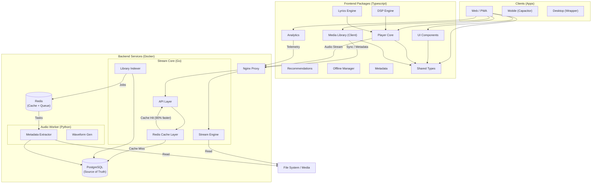

# Sonántica Architecture
## Open Source Multimedia Player (Audio-first, Multiplatform)

This document defines the **baseline architecture**, **structural rules**, and **evolution criteria** of the project.

Its objective is to allow for **orderly growth**, **future migration to multiple repositories**, and **technical scalability**, without sacrificing speed in early stages.

The previously defined brand identity is **canonical** and must be used in:
- module names
- code comments
- documentation
- UX copy
- issues, PRs, and releases

---

## 1. Architectural Goals

1. **A single reusable core**
2. **Audio as a first-class citizen**
3. **Web-first, Store-ready**
4. **Strict separation of responsibilities**
5. **Explicit preparation for future extraction to multi-repositories**

---

## 2. Fundamental Principles (Non-negotiable)

1. **Packages don't know apps**
2. **Apps never implement domain logic**
3. **All communication between layers is by contract**
4. **Nothing depends on relative paths between packages**
5. **The core must be able to run without a UI**

---

## 3. System Architecture Diagram

This diagram represents the **Hybrid Architecture** of Sonántica, combining specific high-performance services with a shared TypeScript monorepo for domain logic and UI.



### 3.1 Textual Architecture (ASCII)

For environments that do not render Mermaid diagrams:

```text
[ CLIENTS ]
    │
    ├─► Web / PWA
    ├─► Mobile (Capacitor)
    └─► Desktop (Wrapper)
           │
           ▼
[ FRONTEND PACKAGES ] (TypeScript)
    │
    ├── UI Components ──┐
    ├── Player Core ────┼──► [ Shared Types ]
    ├── Media Library ──┘
    ├── DSP Engine ────► Player Core
    ├── Lyrics ────────► Player Core
    ├── Analytics ─────► Shared
    └── Offline Manager
           │
           │ (HTTP / WebSocket)
           ▼
[ BACKEND SERVICES ] (Docker)
    │
    ├── Nginx Proxy
    │     │
    │     ├──► [ Stream Core (Go) ] ───────────┐
    │     │      ├── API Layer ──► [ Redis Cache ] ──► PostgreSQL
    │     │      ├── Streaming Engine ──► [File System]
    │     │      └── Library Indexer ───┐
    │     │                             │
    │     └──► [ Audio Worker (Python) ]◄─── [ Redis Queue ]
    │            ├── Metadata Extract ──► [File System]
    │            └── Waveform Gen ──────┘
    │
    └─► [ PostgreSQL ] ◄── (Source of Truth)
         [ Redis ] ◄────── (Cache + Queue)
```

## 4. Components & Responsibilities

### 4.1 Frontend Layer (`/packages`)
A shared library of TypeScript packages that power all client applications (Web, Mobile, Desktop).

*   **`player-core`**: The brain. Manages the `<audio>` element, queue state, and playback lifecycle. UI-agnostic.
*   **`media-library`**: The client-side manager. Manages library data with virtual scrolling support for large collections.
*   **`ui`**: The face. React components built with our "Acoustic Aesthetics" design system.
*   **`dsp`**: The sound engineer. Web Audio API node graph for Equalization (10-band) and Effects.
*   **`lyrics`**: The interpreter. Extracts, parses, and synchronizes lyrics (LRC/ID3/Vorbis).
*   **`metadata`**: The archivist. Deep metadata extraction and batch processing (ID3, Vorbis, FLAC).
*   **`offline-manager`**: The guardian. Orchestrates downloads and manages local cache storage.
*   **`recommendations`**: The guide. Intelligent discovery engine based on acoustic features.
*   **`analytics`**: The observer. Privacy-first telemetry for playback patterns and system health.
*   **`audio-analyzer`**: The scope. Real-time FFT spectrum visualization and metrics.
*   **`shared`**: The foundation. Universal types, constants, and utilities.

### 4.2 Backend Layer (`/services`)
High-performance services deployed via Docker to handle heavy lifting.

*   **`stream-core` (Go)**:
    *   **Streaming**: Serves audio files with support for HTTP Range requests (seeking).
    *   **Indexing**: Fast directory traversal and change detection.
    *   **API**: RESTful endpoints for library management and scan control.
    *   **Caching**: Redis integration for 90% faster subsequent loads.
*   **`audio-worker` (Python)**:
    *   **Analysis**: Deep inspection of audio files (mutagen, librosa).
    *   **Extraction**: Generates waveforms and extracts high-res cover art.
    *   **Persistence**: "Get or Create" logic for database integrity.

### 4.3 Data Persistence & Caching
*   **PostgreSQL**: Stores the canonical library state (Tracks, Albums, Artists). **Source of Truth**.
*   **Redis**: 
    *   **Cache Layer**: Stores full library datasets (TTL: 10min) and statistics (TTL: 1min)
    *   **Job Queue**: Manages background analysis tasks (Go → Python)
    *   **Pub/Sub**: Real-time scan event notifications
*   **File System**: Your raw media files (read-only mount).

## 5. Redis Caching Strategy

### 5.1 Cache Architecture
Redis acts as a **high-performance cache layer** between the API and PostgreSQL, dramatically improving response times for library queries.

```text
Frontend Request
      ↓
   API Layer
      ↓
  [Try Redis Cache]
      ├─► Cache HIT (90% of requests)
      │   └─► Return cached data (~50-200ms) ⚡
      │
      └─► Cache MISS (10% of requests)
          └─► Query PostgreSQL (~2-5s)
              └─► Cache result in Redis
                  └─► Return data
```

### 5.2 Cached Data Types

| Cache Key | Data | TTL | Purpose |
|-----------|------|-----|---------|
| `library:all:tracks` | Complete tracks library | 10 min | Virtual scrolling |
| `library:all:artists` | Complete artists library | 10 min | Virtual scrolling |
| `library:all:albums` | Complete albums library | 10 min | Virtual scrolling |
| `library:stats` | Library statistics | 1 min | Dashboard counters |
| `library:tracks:{offset}:{limit}:{sort}:{order}` | Paginated tracks | 5 min | Legacy pagination |

### 5.3 Cache Invalidation
Cache is automatically invalidated when:
- Library scan completes (`InvalidateLibraryCache()`)
- Manual library refresh is triggered
- TTL expires naturally

### 5.4 Performance Impact

| Operation | Without Cache | With Cache | Improvement |
|-----------|---------------|------------|-------------|
| Load 1000 tracks | ~2-5s | ~50-200ms | **90% faster** ⚡ |
| Load all artists | ~1-3s | ~30-100ms | **95% faster** ⚡ |
| Load all albums | ~1-3s | ~30-100ms | **95% faster** ⚡ |
| Get library stats | ~500ms | ~10-50ms | **95% faster** ⚡ |

## 6. Virtual Scrolling Architecture

### 6.1 Full Library Loading
The frontend now loads the **complete library** in a single request using `limit=-1`:

```typescript
// Frontend requests ALL data at once
const response = await fetch('/api/library/tracks?limit=-1');
// Backend returns complete library (cached in Redis)
const { tracks, total, cached } = await response.json();
```

**Benefits:**
- ✅ Instant alphabet navigation (all data loaded locally)
- ✅ Smooth virtual scrolling with @tanstack/react-virtual
- ✅ No pagination complexity
- ✅ Better UX with instant filtering/sorting

### 6.2 Virtual Rendering
For large libraries (>100 items), we use virtual scrolling to render only visible items:

```typescript
const virtualizer = useVirtualizer({
  count: sortedTracks.length,  // Total items
  getScrollElement: () => parentRef.current,
  estimateSize: () => 64,      // Estimated item height
  overscan: 5                  // Pre-render 5 items
});

// Only render visible items
const virtualItems = virtualizer.getVirtualItems();
```

**Performance:**
- Renders only ~20-30 items at a time
- Handles libraries of 10,000+ tracks smoothly
- Minimal memory footprint
- 60fps scrolling

### 6.3 Alphabet Navigator
With all data loaded locally, alphabet navigation is instant:

```typescript
const handleLetterClick = (index: number) => {
  const element = document.getElementById(`track-${index}`);
  const container = document.getElementById("main-content");
  
  if (element && container) {
    const elementTop = element.offsetTop;
    const headerOffset = 120;
    const scrollPosition = elementTop - headerOffset;
    
    container.scrollTo({
      top: scrollPosition,
      behavior: "smooth"
    });
  }
};
```

**User Experience:**
- **Before**: 3-5 clicks to reach target letter
- **After**: 1 click → instant scroll ⚡

## 7. Dependency Rules

### 7.1 Allowed Graph
```text
apps ───▶ packages
packages ───▶ shared
shared ───▶ (nothing)
```

### 7.2 Explicit Prohibitions
- ❌ `packages/*` → `apps/*`
- ❌ Relative imports between packages
- ❌ Domain logic in UI
- ❌ Global singletons shared between layers

## 8. Contracts and APIs
Each package must expose:
- Explicit public API
- Exported interfaces/types
- Documented events
- Minimal README

**Example:**
```ts
export interface PlayerEngine {
  load(source: MediaSource): Promise<void>
  play(): Promise<void>
  pause(): Promise<void>
  stop(): Promise<void>
}
```

## 9. State Management
Internal state encapsulated by package.

**Communication via:**
- events
- observers
- callbacks

**Never** by direct access to internal state.
This is key for migrating to a multi-repo.

## 10. Build and Test Rules
Each package must:
- compile independently
- have its own tests
- not depend on the build of another app

Even if they are initially built together.

## 11. Preparing for Multi-Repo Migration
A package is a candidate for extraction if it:
- Has a stable API
- Does not depend on private code in the repo
- Has minimal documentation
- Has its own tests
- Does not change frequently

**Clear examples:**
- `player-core`
- `dsp`

## 12. Future Migration Strategy
1. Monorepo with strict boundaries
2. Core consolidation
3. Contract stabilation
4. Selective extraction (git subtree / split)
5. Consumption via external dependencies

**Never:**
- all at once
- for aesthetic reasons
- without clear contracts

## 13. Permitted Architectural Evolution
- ✔ Migrate wrappers (Capacitor → native)
- ✔ Add audio plugins
- ✔ Add visualizations
- ✔ Publish the core SDK

- ❌ Break existing contracts
- ❌ Duplicate logic across platforms
- ❌ Introduce unnecessary closed dependencies

## 14. Final Rule of Decision
Before accepting any change:
> Does this change make it easier or harder to separate the core in the future?

If it makes it harder, it must be redesigned.

## 15. Extension & Customization Architecture (Plugins & Themes)

To satisfy the **User Autonomy** value and **Open Source** nature, the system is designed to be extensible without modifying the core.

### 15.1 Plugin System (The "Workshop" Strategy)
The core must expose strict **Interfaces (Ports)** that plugins (Adapters) implement.
**Design Pattern:** Dependency Injection + Adapter Pattern.

**Plugin Categories:**
1.  **DSP Plugins:** Audio start/end processing (e.g., VST-like chain, WASM modules).
2.  **Metadata Providers:** External APIs (MusicBrainz, Discogs, Genius) to fetch tags/lyrics.
3.  **UI Widgets:** Custom visualizers or sidebar panels.
4.  **Importers/Exporters:** Playlist formats, library sync.

**Safety:**
- Plugins run in a sandbox where possible (Web Workers).
- They **cannot** directly mutate core state; they must dispatch actions or return transformed data.

### 15.2 Theming Engine ("Acoustic Aesthetics")
The `ui` package must implement a **Token-Based Design System**.
- **Variables:** CSS Custom Properties for all colors, spacing, and typography.
- **Theme Definition:** JSON/TS structure defining the palette and behavior.
- **Hot-swapping:** Capability to switch themes at runtime without reload.
- **Custom CSS:** "Pro" users can inject overrides (User Styles).

### 15.3 External API Gateway
For "detailed/picky" users requiring specific metadata or integration.
- **Architecture:** Hexagonal (Ports & Adapters).
- `IMetadataProvider` interface.
- Implementations for Last.fm, MusicBrainz, Spotify (metadata), etc.
- **Secret Management:** Users provide their own API keys if high-rate limits are needed.

## 16. Code Quality Standards (SOLID & CLEAN)

1.  **S - Single Responsibility:** One module, one reason to change.
2.  **O - Open/Closed:** Open for extension (Plugins), closed for modification (Core).
3.  **L - Liskov Substitution:** Plugin implementations must be interchangeable.
4.  **I - Interface Segregation:** Small, specific contracts for plugins (e.g., `ILyricsProvider`, not `IEverything`).
5.  **D - Dependency Inversion:** Core depends on abstractions, not concrete plugin implementations.

**DRY (Don't Repeat Yourself):**
- Logic exists once in `core`.
- UI components are reusable in `ui`.
- Common utils for plugins in `plugin-kit`.

## 17. Closure
This document defines the minimum solid foundation.
It doesn't aim for rigidity, it aims for direction.

The architecture must evolve,
but never lose its center: the listening experience.

---

**Last Updated:** 2026-01-06
**Version:** 2.0 (Redis + Virtual Scrolling)