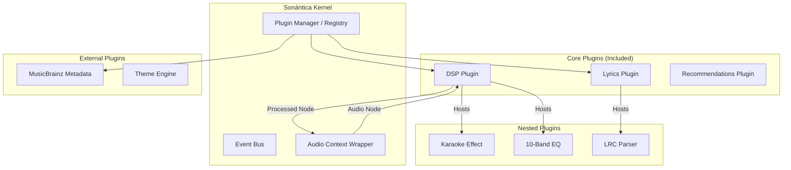

# Sonántica Plugin System Architecture

**Status:** Draft
**Context:** Based on `ARCHITECTURE.md`, `IDENTITY.md`
**Goal:** Transform Sonántica into a modular "Lego-like" system where even core features (DSP, Lyrics) are plugins.

---

## 1. Philosophy: The "Invisible" Kernel

To fulfill the **wise craftsman** persona, the core must be humble and stable. It provides the **canvas**, while plugins provide the **paint**.

> "The core doesn't know *how* to process audio effects, it only knows *where* to put them."

### 1.1 Core Principles
1.  **Everything is a Plugin:** DSP, Lyrics, Recommendations are not hardcoded features, but "Core Plugins".
2.  **Toggleable & Safe:** Disabling the DSP plugin just means the audio signal flows straight through. The app never crashes because a plugin is missing.
3.  **Recursive Modularity:** Plugins can be hosts. The DSP Plugin is a host for "Effect Plugins" (Reverb, EQ).
4.  **Strict Contracts:** Communication happens via strictly typed Interfaces (`Ports`), never direct implementation coupling.

---

## 2. High-Level Architecture



---

## 3. The Contract: `IPlugin`

All plugins must strictly adhere to this interface.

```typescript
export interface IPluginContext {
  token: string; // Unique identifier
  version: string;
  api: ISonanticaCoreAPI; // Access to safe kernel methods
  config: Record<string, any>; // User preferences
}

export interface IPlugin {
  // Identity
  readonly id: string;
  readonly name: string;
  readonly type: PluginType; // 'dsp' | 'metadata' | 'ui' | 'general'
  
  // Lifecycle
  initialize(context: IPluginContext): Promise<void>;
  enable(): Promise<void>;
  disable(): Promise<void>;
  destroy(): Promise<void>;
  
  // Capability Discovery
  getCapabilities(): string[]; // e.g., ['lyrics-provider', 'dsp-node']
}
```

---

## 4. Plugin Categories & Implementation

### 4.1 DSP Architecture (The "Audio Rack")

The **DSP Plugin** (`@sonantica/plugin-dsp`) acts as a container/host.

- **Role:** It intercepts the `AudioNode` chain from the Kernel.
- **Internal Logic:** It maintains an internal `Chain` of effects.
- **Nested Plugins:** Individual effects (Karaoke, Reverb, Compressor) are plugins *consumed* by the DSP Plugin.

**Interface:**
```typescript
interface IDSPPlugin extends IPlugin {
  process(input: AudioNode, output: AudioNode): void;
  registerEffect(effect: IDSPEffect): void;
}

interface IDSPEffect {
  id: string;
  createNode(context: AudioContext): AudioNode;
  params: Record<string, AudioParam | number>;
}
```

**Scenario: "Karaoke Mode"**
1. User enables "Karaoke".
2. The `KaraokeProcessor` (Nested Plugin) is instantiated.
3. The DSP Plugin injects it into the audio chain: `Source -> EQ -> [Karaoke] -> Destination`.
4. If the DSP Plugin is disabled, the chain collapses to `Source -> Destination`.

### 4.2 Metadata & Services (The "Collectors")

Plugins like **MusicBrainz** or **Lyrics** are `Providers`.

- **Pattern:** Chain of Responsibility / Fallback.
- **Logic:** The Kernel asks: "Who has metadata for this Track?"
- **Flow:**
    1. Local Tags Plugin (Priority 1) -> Returns partial data.
    2. MusicBrainz Plugin (Priority 2) -> Fills missing dates/labels.
    3. Last.fm Plugin (Priority 3) -> Adds play counts.

**Interface:**
```typescript
interface IMetadataProvider extends IPlugin {
  fetchMetadata(track: TrackSignature): Promise<Partial<TrackMetadata>>;
}
```

### 4.3 UI Widgets (The "Dashboard")

Plugins can inject React Components into specific "Slots" in the UI.

- **Slots:** `Sidebar`, `MainContent`, `PlayerBar`, `ContextMenu`.
- **Mechanism:** The `UI Core` renders `<PluginSlot name="sidebar-bottom" />`. Plugins register components to render there.

**Example:**
- **Lyrics Plugin** registers a component in the `RightSidebar` slot.
- **Visualizer Plugin** registers a canvas in the `MainBackground` slot.

---

## 5. Implementation Strategy: "The Registry"

We need a central service to manage this.

### 5.1 The `PluginRegistry`

```typescript
class PluginRegistry {
  private plugins: Map<string, IPlugin> = new Map();
  private enabledPlugins: Set<string> = new Set();

  register(plugin: IPlugin) {
    // Validate signature & version
    this.plugins.set(plugin.id, plugin);
  }

  async activate(id: string) {
    const plugin = this.plugins.get(id);
    if (!plugin) throw new Error("Plugin not found");
    
    // Sandbox execution (Task for later: WebWorkers)
    await plugin.initialize(this.createContext(id));
    await plugin.enable();
    this.enabledPlugins.add(id);
    
    this.emit('plugin:activated', id);
  }
}
```

---

## 6. Migration Roadmap

To move from the current monolith to this architecture:

1.  **Phase 1: Abstract Interfaces (The "Ports")**
    - Define `ISonanticaCore` in `@sonantica/shared`.
    - Define `IDSPProvider`, `ILyricsProvider`.

2.  **Phase 2: Internal "Plugins"**
    - Refactor existing DSP logic into a class that implements `IDSPProvider`.
    - Refactor existing Lyrics logic into `ILyricsProvider`.
    - *At this stage, they are still hardcoded imports, but used via interfaces.*

3.  **Phase 3: The Dynamic Loader**
    - Implement `PluginRegistry`.
    - Change `App.tsx` from importing `DSP` directly to requesting `registry.getService('dsp')`.

4.  **Phase 4: Remote Plugins (Future)**
    - Allow loading `.js` files from an external URL or `plugins/` folder.

---

## 7. Safety & Sandboxing (Critical)

Since plugins can execute code:
1.  **UI Plugins:** Run in the main thread (React). **Risk:** High (Can freeze UI).
    - *Mitigation:* strict timeouts, Error Boundaries around PluginSlots.
2.  **Logic Plugins (Metadata/DSP):** Should eventually move to **Web Workers**.
    - *Mitigation:* AudioWorklet for DSP is mandatory. Metadata fetching happens in `shared-worker` to avoid blocking UI.

## 8. Summary for the User

This architecture allows **Sonántica** to be:
- **Resilient:** If the Lyrics plugin crashes, the player keeps playing.
- **Customizable:** Don't like our EQ? Write your own WASM EQ and swap it.
- **Lightweight:** Disable Recommendations, and the app consumes less memory.
